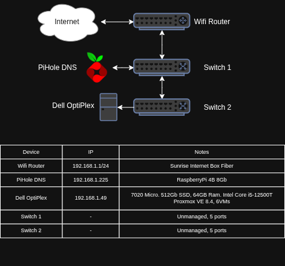
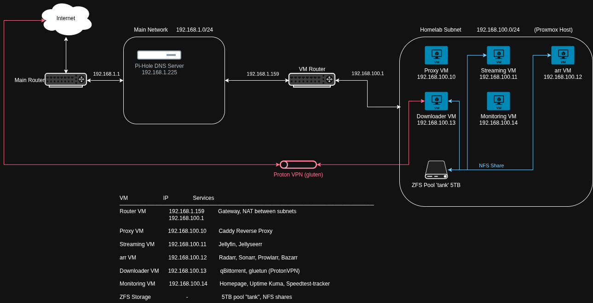

# Homelab Infrastructure

Ansible-managed homelab infrastructure running on Proxmox VE with security-focused VM segmentation and network isolation.

## Architecture

### Network Diagrams

- Hardware layout and physical connections
  
   

- Network segmentation and service architecture

  

### Infrastructure Overview

**Hardware:**
- Dell OptiPlex 7020 Micro
  - Intel Core i5-12500T
  - 64GB RAM
  - 512GB SSD
  - Proxmox VE 8.4
- 5TB ZFS pool "tank" with NFS shares
- Raspberry Pi 4B 8GB (Pi-hole DNS)

**Network Segmentation:**
- Main network: `192.168.1.0/24` (home devices)
- Homelab subnet: `192.168.100.0/24` (isolated VM network)
- Router VM bridges between networks

### Virtual Machines

| VM | IP | Services | Purpose |
|---|---|---|---|
| router | 192.168.1.159 / 192.168.100.1 | gateway, NAT | Network bridge between subnets |
| proxy | 192.168.100.10 | Caddy | Reverse proxy, ingress/edge |
| streaming | 192.168.100.11 | Jellyfin, Jellyseerr | Media streaming, public-facing |
| arr | 192.168.100.12 | Radarr, Sonarr, Prowlarr, Bazarr | Media automation |
| downloader | 192.168.100.13 | qBittorrent, gluetun | Downloads via ProtonVPN with kill switch |
| monitoring | 192.168.100.14 | Homepage, Uptime Kuma, Speedtest-tracker | Observability |
| library | 192.168.100.15 | Calibre-Web, Audiobookshelf | Ebook and audiobook library |

### Storage

- ZFS pool "tank" (5TB) provides NFS shares
- Mounted by: streaming VM, arr VM, downloader VM


### Internal DNS (.lan domains)

All services accessible via Pi-hole local DNS:
- `jellyfin.lan`, `jellyseerr.lan`, `radarr.lan`, `sonarr.lan`
- `prowlarr.lan`, `bazarr.lan`, `qbittorrent.lan`
- `homepage.lan`, `uptime.lan`, `speedtest.lan`
- `calibre.lan`, `audiobookshelf.lan`

## Security

- **Network isolation:** Homelab VMs run on a dedicated `192.168.100.0/24` subnet behind a router VM that bridges to the main LAN. Inter-network traffic is controlled at the routing layer.
- **Host firewalls:** Each VM has iptables rules defined in Ansible with a default INPUT policy of DROP. Only explicitly allowed ports and sources are permitted, scoped per-host.
- **SSH hardening:** Password authentication disabled, root login denied, max 3 auth attempts. Key-only access across all VMs.
- **VPN kill switch:** The downloader VM routes all traffic through ProtonVPN via gluetun.
- **Service segmentation:** Each service category runs on a dedicated VM to limit blast radius if one is compromised.
- **Reverse proxy:** Caddy handles internal traffic routing for all `.lan` services within the homelab network.
- **External access:** Public-facing services (streaming) are exposed through a Cloudflare Tunnel. No inbound ports are opened on the home network.
- **Secrets management:** All sensitive values (API keys, tunnel credentials) encrypted with Ansible Vault.

## Usage

### Prerequisites

- Proxmox VE host with VMs provisioned (see [homelab-terraform](https://github.com/ArianDervishaj/homelab-infra) for automated provisioning)
- SSH key access to all VMs
- Ansible Vault password for encrypted secrets

### Deploy
```bash
# Deploy everything
ansible-playbook playbooks/all.yml --ask-vault-pass

# Deploy a single stack (e.g. monitoring)
ansible-playbook playbooks/monitoring.yml --ask-vault-pass
```
